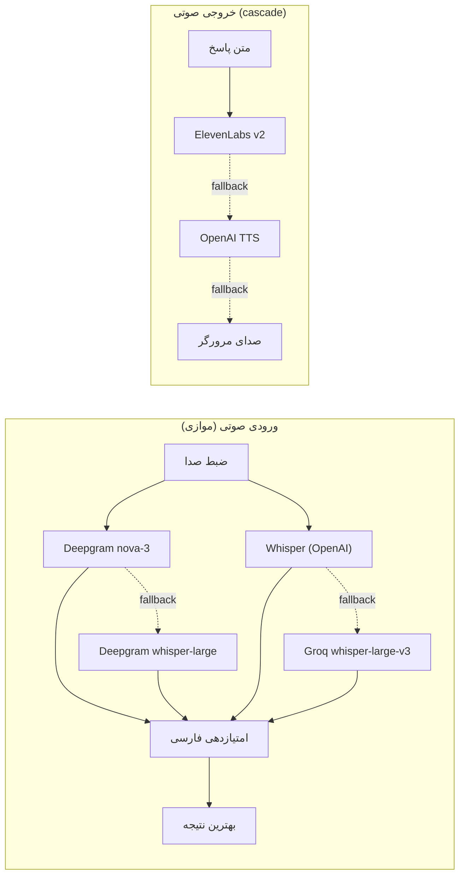
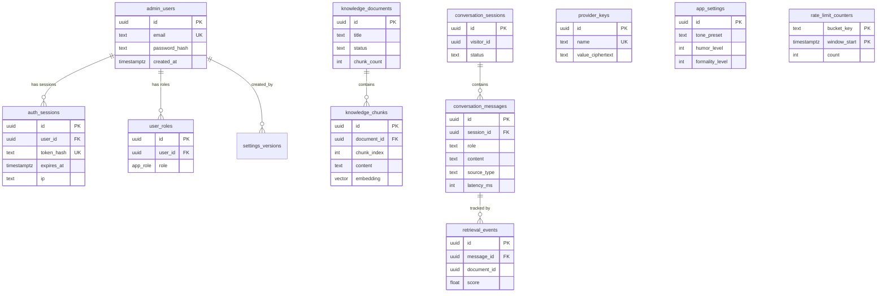
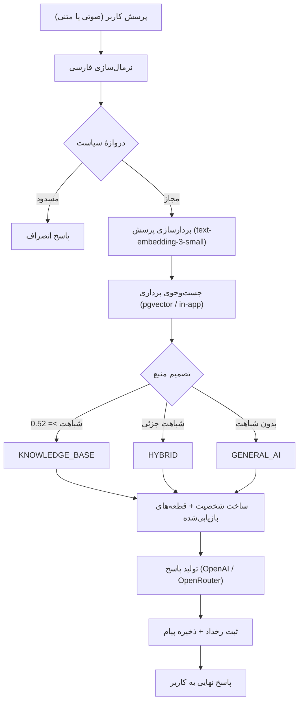
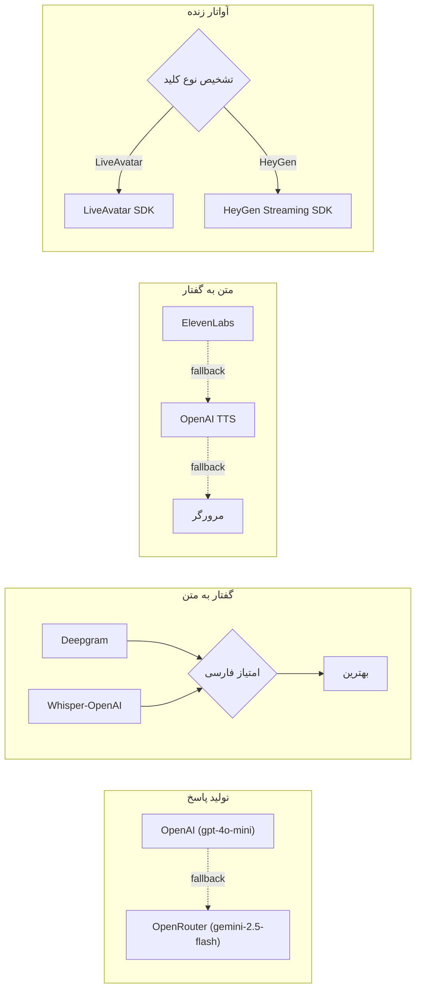
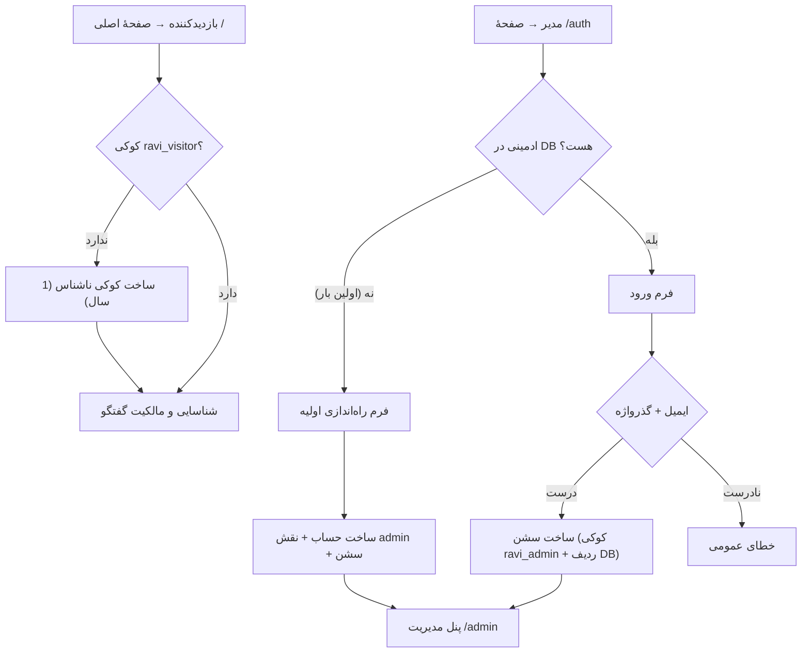

# راوی‌استان — دستیار هوشمند گفتگومحور سازمانی با آواتار زنده

راوی‌استان یک دستیار هوشمند **فارسی‌زبان** با **حضور بصری تعاملی** است: کاربر با **صدا یا متن** پرسش می‌کند، سامانه پاسخ را از **پایگاه دانش سازمان** استخراج می‌کند و یک **آواتار زنده** با **لب‌خوانی فارسی** آن را بیان می‌کند. تمام رابط کاربری فارسی و راست‌به‌چپ است.

---

## 🔑 مدل دسترسی (مهم)

| مسیر | چه کسی؟ | توضیح |
|---|---|---|
| `/` | **همه، بدون حساب کاربری** | هر بازدیدکننده مستقیم وارد می‌شود و با میکروفن یا تایپ گفتگو می‌کند. هیچ ثبت‌نام و ورودی لازم نیست. |
| `/auth` | فقط مدیران | ورود مدیر. هیچ لینکی از صفحهٔ اصلی به اینجا نیست. |
| `/admin` | فقط مدیران | تنظیمات، کلیدهای API، پایگاه دانش و بایگانی گفتگوها. |

**ثبت‌نام عمومی وجود ندارد.** ورود کاربر عادی و «فراموشی گذرواژه» هم وجود ندارد — این مسیرها حذف شده‌اند، نه پنهان. تنها راه ساخت حساب مدیر، اجرای `npm run db:seed-admin` روی سرور است؛ همین دستور، راه بازنشانی گذرواژهٔ فراموش‌شده هم هست.

**بازدیدکنندهٔ ناشناس** یک کوکی امضاشده می‌گیرد که فقط مالکیت گفتگوی خودش را ثابت می‌کند. با این کوکی نمی‌توان به پنل مدیریت، تنظیمات، کلیدها، اسناد یا گفتگوی بازدیدکنندهٔ دیگر رسید.

### محدودیت نرخ درخواست

چون صفحهٔ اصلی روی اینترنت باز است و هر تماس هزینهٔ واقعی دارد، همهٔ مسیرهای عمومی سقف دارند:

| عملیات | سقف پیش‌فرض (هر بازدیدکننده) | متغیر محیطی |
|---|---|---|
| پرسش | ۲۰ در دقیقه / ۳۰۰ در روز | `RL_ASK_PER_MIN`، `RL_ASK_PER_DAY` |
| تبدیل گفتار به متن | ۲۰ در دقیقه | `RL_STT_PER_MIN` |
| تولید صدا | ۴۰ در دقیقه | `RL_TTS_PER_MIN` |
| **نشست آواتار زنده** | ۳ در ساعت + سقف کل حساب ۲۰۰ در روز | `RL_AVATAR_PER_HOUR`، `RL_AVATAR_GLOBAL_PER_DAY` |
| ورود مدیر | ۱۰ تلاش در ۱۵ دقیقه (بر پایهٔ IP) | `RL_LOGIN_PER_15MIN` |

سقف آواتار از همه سخت‌گیرانه‌تر است چون هر نشست، اعتبار پولی HeyGen مصرف می‌کند؛ سقف کلِ حساب همان چیزی است که در برابر حملهٔ توزیع‌شده از شما محافظت می‌کند.

شمارنده‌ها هم روی کوکی بازدیدکننده و هم روی IP اعمال می‌شوند تا پاک‌کردن کوکی سقف را صفر نکند. سهم هر IP به‌اندازهٔ `RL_IP_MULTIPLIER` (پیش‌فرض ۱۵ برابر) بیشتر است، چون در بسیاری از شبکه‌ها ده‌ها کاربر پشت یک IP مشترک هستند و نباید با پرمصرف‌بودن یک نفر همه مسدود شوند. حجم فایل صوتی هم پیش از رسیدن به سرویس پولی محدود می‌شود.

---

## ✨ قابلیت‌های کلیدی

- 🎤 **گفتگوی صوتی کامل فارسی** — تشخیص گفتار و پاسخ صوتی با لهجهٔ طبیعی
- 👤 **آواتار زنده تعاملی** — HeyGen/LiveAvatar با لب‌خوانی (lip-sync) فارسی
- 🧠 **RAG هوشمند** — پاسخ مبتنی بر اسناد سازمانی با شفافیت منبع
- 🔒 **زیرساخت مستقل** — پایگاه داده و کلیدها در اختیار خودتان
- 🎯 **سیاست‌سنجی پیشرفته** — فیلتر محتوا قابل تنظیم
- 📱 **رابط کاربری فارسی کامل** — RTL، فونت فارسی، تم تاریک مدرن

### گفتگوی صوتی فارسی



**ورودی صوتی:** تشخیص موازی با Whisper (OpenAI/Groq) و Deepgram، امتیازدهی خودکار برای انتخاب بهترین نتیجه، و فیلتر توهمات صوتی.

**خروجی صوتی:** ElevenLabs Multilingual v2 (بهترین کیفیت) ← OpenAI TTS با دستورالعمل‌های فارسی ← صدای مرورگر.

**لب‌خوانی:** HeyGen/LiveAvatar با تنظیم خودکار `language: "fa"` و انتخاب خودکار صدای فارسی.

📚 [راهنمای کامل صدا](PERSIAN_VOICE_SETUP.md) · 🚀 [راهنمای استقرار](DEPLOYMENT.md)

---

## ۱. نمای کلی معماری

```text
┌──────────────────────────── مرورگر (React 19 + TanStack Start) ───────────────────────────┐
│  صفحهٔ عمومی «/» (بدون حساب)                          پنل مدیریت «/admin» (فقط مدیر)      │
│  ├── لایهٔ حضور: AvatarOrb (شش حالت)                  ├── پایگاه دانش (PDF)               │
│  ├── ویدئوی آواتار: HeyGen/LiveAvatar SDK             ├── رفتار و سیاست‌ها                │
│  ├── ضبط صدا: MediaRecorder                           ├── گفتگوها                         │
│  └── متن گفتگو: پنل شیشه‌ای شناور                     └── کلیدها و گالری آواتار            │
└───────────────────────────────────┬───────────────────────────────────────────────────────┘
                                    │ Server Functions
┌───────────────────────────────────▼───────────────────────────────────────────────────────┐
│                         لایهٔ سرور (TanStack Start – Node)                                 │
│  api.functions.ts ──── مسیرهای عمومی: مالکیت نشست + سقف نرخ + محدودیت ورودی                │
│  admin.functions.ts ── مسیرهای مدیریتی، همه پشت requireAdmin                               │
│  auth.server.ts ────── نشست مدیر (کوکی امضاشده → ردیف پایگاه داده)                         │
│  visitor.server.ts ─── هویت ناشناس بازدیدکننده و بررسی مالکیت گفتگو                        │
│  ratelimit.server.ts ─ شمارندهٔ پنجرهٔ ثابت در پایگاه داده                                  │
│  pipeline.server.ts ── سیاست‌سنجی → بازیابی دانش → شخصیت → تولید پاسخ → ثبت رخداد           │
│  providers.server.ts ─ انتخاب سرویس‌دهنده (OpenAI / OpenRouter / Groq / Deepgram)           │
│  vector.server.ts ──── جست‌وجوی برداری: pgvector یا محاسبه در برنامه                        │
│  heygen.server.ts ──── توکن کوتاه‌عمر آواتار، فهرست چهره‌ها و صداها                         │
│  ingest.server.ts ──── استخراج متن PDF، قطعه‌بندی، بردارسازی                                │
└───────────────────────────────────┬───────────────────────────────────────────────────────┘
                                    │
┌───────────────────────────────────▼───────────────────────────────────────────────────────┐
│                       PostgreSQL (اختیاری: pgvector)                                       │
│  admin_users · auth_sessions · user_roles · app_settings · knowledge_documents ·           │
│  knowledge_chunks · conversation_sessions · conversation_messages · retrieval_events ·     │
│  provider_events · provider_keys · settings_versions · rate_limit_counters · system_meta   │
└────────────────────────────────────────────────────────────────────────────────────────────┘
```

فقط سرور به پایگاه داده وصل می‌شود؛ مرورگر هرگز اتصال مستقیم ندارد. به همین دلیل کنترل دسترسی در کد برنامه اعمال می‌شود، نه با RLS.

### نمودار پایگاه داده



---

## ۲. الگوریتم پاسخ‌گویی

هر پرسش از یک خط لولهٔ پنج‌مرحله‌ای عبور می‌کند:



1. **نرمال‌سازی فارسی** — یکسان‌سازی «ی/ک»، حذف اعراب و کشیدگی، تبدیل ارقام فارسی/عربی به لاتین.
2. **دروازهٔ سیاست (Policy Gate)** — پیش‌فیلتر واژگانی سریع، و در صورت شک، طبقه‌بندی با مدل. اگر مسدودسازی فعال باشد، پاسخ محترمانهٔ انصراف برگردانده می‌شود و هیچ فراخوانی پرهزینه‌ای انجام نمی‌شود.
3. **بازیابی دانش (RAG)** — بردار پرسش با `text-embedding-3-small` ساخته و نزدیک‌ترین قطعه‌ها بازیابی می‌شود.
   - شباهت بالاتر از آستانه → منبع پاسخ: «دانش سازمان»
   - شباهت پایین → منبع پاسخ: «دانش عمومی» و این موضوع صریحاً گفته می‌شود.
4. **ساخت شخصیت (Persona)** — قاعدهٔ ثابت: *واقعیت اول، لحن دوم*. لحن هرگز محتوا یا منبع را تغییر نمی‌دهد.
5. **تولید و ثبت** — پاسخ ثبت می‌شود همراه با تأخیر، مصرف توکن و نوع منبع.

**تاریخچهٔ گفتگو در سرور بازسازی می‌شود**، نه از سمت کاربر گرفته می‌شود؛ چون مسیر عمومی است و پذیرفتن تاریخچه از کاربر هم هزینه را بالا می‌برد و هم راه تزریق پرامپت باز می‌کند.

### شش حالت حضور آواتار
`IDLE` · `CONNECTING` · `LISTENING` · `THINKING` · `SPEAKING` · `ERROR` — هر حالت رنگ و ریتم انیمیشن خود را دارد.

---

## ۳. سرویس‌دهنده‌ها و کلیدها

| سرویس | متغیر | نقش | اجباری؟ |
|---|---|---|---|
| **OpenAI** | `OPENAI_API_KEY` | پاسخ‌گویی، بردارسازی، گفتار به متن، صدای جایگزین | **بله** |
| **HeyGen / LiveAvatar** | `HEYGEN_API_KEY` | آواتار زنده با lip-sync فارسی | خیر |
| ElevenLabs | `ELEVENLABS_API_KEY` | صدای فارسی بدون لهجه | توصیه می‌شود |
| Deepgram | `DEEPGRAM_API_KEY` | تشخیص گفتار فارسی پیشرفته | خیر |
| Groq | `GROQ_API_KEY` | جایگزین گفتار به متن (Whisper) | خیر |
| OpenRouter | `OPENROUTER_API_KEY` | جایگزین موتور تولید پاسخ | خیر |

یک کلید برای هر دو سرویس HeyGen و LiveAvatar کافی است؛ نوع سرویس از روی خود کلید تشخیص داده می‌شود.



**نحوهٔ ثبت کلید:** یا متغیر محیطی روی سرور، یا پنل مدیریت → تب «کلیدها و آواتار». کلیدهای پنل با AES-256-GCM رمزنگاری و در جدول `provider_keys` ذخیره می‌شوند؛ مقدار خام هرگز به مرورگر برنمی‌گردد. برای HeyGen/OpenRouter/Groq مقدار پنل بر متغیر محیطی اولویت دارد؛ برای OpenAI و ElevenLabs متغیر محیطی اولویت دارد.

---

## ۴. انتخاب چهرهٔ آواتار

۱. کلید HeyGen یا LiveAvatar را ثبت کنید.
۲. پنل مدیریت → تب «کلیدها و آواتار» → «بررسی اتصال».
۳. گالری چهره‌های حساب شما بارگذاری می‌شود؛ چهرهٔ دلخواه را انتخاب کنید.
۴. در صورت نیاز صدای گوینده را انتخاب و «ذخیرهٔ چهره و صدا» را بزنید.

انتخاب پنل بر مقادیر متغیرهای محیطی اولویت دارد.

---

## ۵. پایگاه دانش

- تنها قالب پشتیبانی‌شده: **PDF متنی** (فایل‌های اسکن‌شدهٔ بدون لایهٔ متن پشتیبانی نمی‌شوند).
- متن استخراج، نرمال‌سازی و به قطعه‌های هم‌پوشان تقسیم می‌شود.
- هر قطعه بردارسازی و در `knowledge_chunks` ذخیره می‌شود.
- بازنمایه‌سازی (Reindex) و حذف سند از همان تب ممکن است.

**جست‌وجوی برداری دو مسیر دارد.** اگر پایگاه داده افزونهٔ `pgvector` را بپذیرد، جست‌وجو با نمایهٔ آن انجام می‌شود. اگر نه (بعضی سرویس‌های مدیریت‌شده اجازهٔ `CREATE EXTENSION` نمی‌دهند)، بردارها به‌صورت آرایه ذخیره و شباهت در خود برنامه محاسبه می‌شود. این انتخاب یک‌بار هنگام مهاجرت انجام و در `system_meta` ثبت می‌شود؛ خروجی `npm run db:migrate` می‌گوید کدام مسیر فعال است. مسیر جایگزین تا حدود ۲۰۰۰ قطعه مناسب است.

---

## ۶. حساب مدیریتی



- حساب فقط با `npm run db:seed-admin` ساخته می‌شود.
- اجرای دوبارهٔ همان دستور با ایمیل یکسان، گذرواژه را عوض می‌کند و همهٔ نشست‌های قبلی را باطل می‌کند — این تنها راه بازیابی گذرواژه است.
- نشست مدیر یک کوکی `httpOnly` امضاشده است که به ردیفی در `auth_sessions` اشاره می‌کند؛ خروج یا تغییر گذرواژه، دسترسی را بی‌درنگ باطل می‌کند.

---

## ۷. ساختار پوشه‌ها

```text
migrations/               مهاجرت‌های SQL (به ترتیب شماره اجرا می‌شوند)
scripts/
├── migrate.ts            اجرای مهاجرت‌ها
├── seed-admin.ts         ساخت/بازنشانی حساب مدیر
└── e2e-check.mjs         آزمون سرتاسری کنترل دسترسی و سقف نرخ
src/
├── routes/
│   ├── index.tsx         صحنهٔ عمومی آواتار
│   ├── admin.tsx         پنل مدیریت (چهار تب)
│   └── auth.tsx          ورود مدیر
├── components/ravi/      AvatarOrb، AvatarStreamer، Transcript، تب‌های مدیریتی
├── hooks/useVoiceCapture.ts
├── lib/db/               اتصال Postgres و انواع ردیف‌ها
└── lib/ravi/
    ├── api.functions.ts      مسیرهای عمومی (بدون حساب)
    ├── admin.functions.ts    مسیرهای مدیریتی (پشت requireAdmin)
    ├── auth.server.ts        نشست مدیر
    ├── visitor.server.ts     هویت ناشناس و مالکیت گفتگو
    ├── ratelimit.server.ts   سقف نرخ
    ├── pipeline.server.ts    خط لولهٔ پاسخ
    ├── vector.server.ts      جست‌وجوی برداری (دو مسیر)
    ├── policy.server.ts      دروازهٔ سیاست
    ├── persona.server.ts     ساخت پرامپت شخصیت
    ├── providers.server.ts   لایهٔ سرویس‌دهنده‌ها
    ├── keystore.server.ts    ذخیرهٔ رمزنگاری‌شدهٔ کلیدها
    ├── heygen.server.ts      توکن و فهرست چهره‌ها
    └── ingest.server.ts      پردازش PDF و بردارسازی
```

---

## 🚀 شروع سریع

```bash
# ۱. وابستگی‌ها
npm install

# ۲. پایگاه داده (محلی)
docker compose up -d

# ۳. تنظیمات
cp .env.example .env
#   DATABASE_URL، OPENAI_API_KEY و دو مقدار زیر را پر کنید:
#   openssl rand -hex 32   → SESSION_SECRET
#   openssl rand -hex 32   → RAVI_KEY_SECRET

# ۴. ساخت جدول‌ها و حساب مدیر
npm run db:migrate
ADMIN_EMAIL=you@example.com ADMIN_PASSWORD='یک-گذرواژهٔ-بلند' npm run db:seed-admin

# ۵. اجرا
npm run dev
```

- صفحهٔ اصلی: <http://localhost:5173/> — بدون حساب، مستقیم گفتگو کنید.
- پنل مدیریت: <http://localhost:5173/auth> — با حسابی که در گام ۴ ساختید.

### دستورهای مفید

| دستور | کار |
|---|---|
| `npm run dev` | اجرای محیط توسعه |
| `npm run build` | ساخت نسخهٔ تولید |
| `npm start` | اجرای نسخهٔ ساخته‌شده |
| `npm run typecheck` | بررسی نوع‌ها |
| `npm run db:migrate` | اجرای مهاجرت‌ها (تکرارپذیر) |
| `npm run db:seed-admin` | ساخت یا بازنشانی حساب مدیر |
| `npm run test:e2e` | آزمون سرتاسری روی سرور در حال اجرا |

---

## ۸. عیب‌یابی سریع

| نشانه | علت محتمل | راه‌حل |
|---|---|---|
| «تنظیمات سامانه در دسترس نیست» | مهاجرت‌ها اجرا نشده‌اند | `npm run db:migrate` |
| خطای اتصال پایگاه داده | `DATABASE_URL` نادرست یا TLS | مقدار را بررسی کنید؛ برای پایگاه محلی `DATABASE_SSL=false` |
| «دسترسی مدیریتی فعال نیست» | نشست منقضی یا حساب بدون نقش مدیر | دوباره وارد شوید یا `db:seed-admin` را اجرا کنید |
| پاسخ‌ها تولید نمی‌شوند | `OPENAI_API_KEY` تنظیم نشده | کلید را در متغیر محیطی یا پنل ثبت کنید |
| به‌جای چهره، گویِ نمادین دیده می‌شود | کلید HeyGen ثبت نشده یا چهره انتخاب نشده | تب «کلیدها و آواتار» |
| پاسخ‌ها همیشه «دانش عمومی» هستند | سند مرتبطی در پایگاه دانش نیست | بارگذاری PDF مرتبط |
| میکروفون کار نمی‌کند | نبود مجوز مرورگر یا نبود HTTPS | صدور مجوز میکروفون؛ روی دامنهٔ HTTPS اجرا کنید |
| «درخواست‌ها زیاد است» | برخورد با سقف نرخ | کمی صبر کنید یا سقف را با متغیرهای `RL_*` تغییر دهید |
| صدا لهجهٔ خارجی دارد | ElevenLabs تنظیم نشده | افزودن `ELEVENLABS_API_KEY` |

---

**ساخته شده با ❤️ برای گفتگوی هوشمند فارسی**
